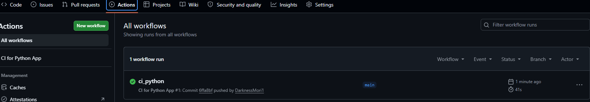
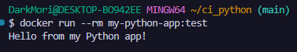

# CI Pipeline для Python-приложения в GitHub Actions

Этот проект представляет собой учебный пример настройки **Continuous Integration (CI)** для простого Python-приложения с использованием **GitHub Actions**.

## 🎯 Цель работы

Создать автоматический CI-пайплайн, который при каждом `push` или `pull request` в ветку `main` будет выполнять:

- **Линтинг** кода с помощью `flake8`
- **Запуск тестов** с помощью `pytest`
- **Сборку Docker-образа** (без публикации в registry)

## 🧱 Структура проекта

```
my-python-app/
├── .github/
│   └── workflows/
│       └── ci.yml          # GitHub Actions workflow
├── myapp/
│   ├── __init__.py
│   └── app.py              # основной код приложения
├── tests/
│   └── test_app.py         # модульные тесты
├── requirements.txt        # зависимости
├── setup.py                # установка в development mode
├── Dockerfile              # инструкция для сборки образа
└── README.md               # описание проекта
```

## 🐍 Содержание файлов проекта

### `myapp/app.py`

```python
def add(a: int, b: int) -> int:
    """Возвращает сумму двух чисел."""
    return a + b

def main():
    print("Hello from my Python app!")

if __name__ == "__main__":
    main()
```

### `setup.py`

```python
from setuptools import setup, find_packages

setup(
    name="my-python-app",
    packages=find_packages(),
)
```

### `tests/test_app.py`

```python
from myapp.app import add

def test_add():
    assert add(2, 3) == 5
    assert add(-1, 1) == 0
    assert add(0, 0) == 0
```

### `requirements.txt`

```
pytest
flake8
```

### `Dockerfile`

```dockerfile
FROM python:3.11-slim
WORKDIR /app
COPY requirements.txt .
RUN pip install --no-cache-dir -r requirements.txt
COPY . .
CMD ["python", "myapp/app.py"]
```

## ⚙️ GitHub Actions Workflow (`.github/workflows/ci.yml`)

```yaml
name: CI for Python App

on:
  push:
    branches: [ main, master ]
  pull_request:
    branches: [ main, master ]

jobs:
  test:
    name: Lint & Test
    runs-on: ubuntu-latest
    strategy:
      matrix:
        python-version: ["3.9", "3.10", "3.11", "3.12"]

    steps:
      - name: Checkout code
        uses: actions/checkout@v4

      - name: Set up Python ${{ matrix.python-version }}
        uses: actions/setup-python@v5
        with:
          python-version: ${{ matrix.python-version }}

      - name: Install dependencies
        run: |
          python -m pip install --upgrade pip
          pip install flake8 pytest
          if [ -f requirements.txt ]; then pip install -r requirements.txt; fi

      - name: Install package in development mode
        run: pip install -e .

      - name: Lint with flake8
        run: |
          flake8 . --count --select=E9,F63,F7,F82 --show-source --statistics
          flake8 . --count --exit-zero --max-complexity=10 --max-line-length=127 --statistics

      - name: Test with pytest
        run: pytest tests/

  docker-build:
    name: Build Docker Image (no push)
    runs-on: ubuntu-latest
    needs: test
    if: github.event_name == 'push' && github.ref == 'refs/heads/main'

    steps:
      - name: Checkout code
        uses: actions/checkout@v4

      - name: Build Docker image
        run: docker build -t my-python-app:test .
```

## 🚀 Запуск CI в GitHub Actions

1. Создайте публичный репозиторий `my-python-app` с `README.md`
2. Склонируйте его и добавьте все файлы по указанной структуре
3. Закоммитьте и запушьте в ветку `main`

После пуша перейдите на вкладку **Actions** вашего репозитория:



*Ожидайте зелёную галочку — все шаги прошли успешно.*

## 🐳 Локальная проверка Docker-образа

На своём компьютере в папке проекта выполните:

### Сборка образа

```bash
docker build -t my-python-app:test .
```

### Запуск контейнера

```bash
docker run --rm my-python-app:test
```



### Интерактивный вход в контейнер (опционально)

```bash
docker run --rm -it my-python-app:test /bin/bash
```

## ✅ Результаты

- [x] Настроен CI-пайплайн в GitHub Actions
- [x] Автоматический линтинг (`flake8`) при каждом push/PR
- [x] Автоматический запуск тестов (`pytest`) на Python 3.9–3.12
- [x] Сборка Docker-образа только при пуше в `main` после успешных тестов
- [x] Локальная сборка и запуск Docker-образа работают корректно

## 📝 Примечание

Если вы обнаружили ошибку в этом тексте или в примере — сообщите автору!